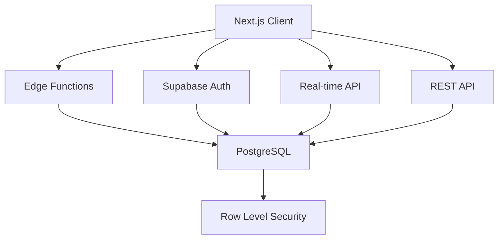

# System Patterns

## Architecture Overview

### Infrastructure


### Core Components

1. **Frontend Layer**
   - Next.js 14 App Router
   - Server and Client Components
   - Supabase Client SDK
   - Real-time subscriptions
   - Progressive enhancement

2. **Backend Layer**
   - Supabase Edge Functions
   - PostgreSQL database
   - Row Level Security
   - Real-time API
   - Storage service

3. **Authentication**
   - Supabase Auth
   - Multiple providers
   - JWT handling
   - Session management
   - Role-based access

4. **Data Layer**
   - PostgreSQL with RLS
   - Real-time subscriptions
   - Optimized queries
   - Cache management
   - Data validation

## Design Patterns

### Frontend Patterns

1. **Component Architecture**
   ```typescript
   // Server Component
   export default async function LoanList() {
     const supabase = createServerClient()
     const { data } = await supabase
       .from('loans')
       .select()
     return <LoanListClient loans={data} />
   }

   // Client Component
   'use client'
   export function LoanListClient({ loans }) {
     const [data, setData] = useState(loans)
     // Real-time subscription setup
     return <div>{/* Render loans */}</div>
   }
   ```

2. **Data Fetching**
   ```typescript
   // Server-side data fetching
   async function getData() {
     const supabase = createServerClient()
     return await supabase
       .from('table')
       .select()
       .single()
   }

   // Client-side real-time
   function useRealtimeData() {
     const supabase = createClientClient()
     useEffect(() => {
       const channel = supabase
         .channel('table_changes')
         .on('postgres_changes', {}, handler)
         .subscribe()
       return () => void supabase.removeChannel(channel)
     }, [])
   }
   ```

3. **Error Handling**
   ```typescript
   try {
     const { data, error } = await supabase.from('table').select()
     if (error) throw error
     return data
   } catch (error) {
     captureError(error)
     return null
   }
   ```

### Backend Patterns

1. **Edge Functions**
   ```typescript
   // Edge function handler
   export const handler = async (req: Request) => {
     const { data, error } = await supabase
       .from('table')
       .select()
     
     return new Response(
       JSON.stringify({ data, error }),
       { headers: { 'Content-Type': 'application/json' } }
     )
   }
   ```

2. **Row Level Security**
   ```sql
   -- Example RLS policy
   CREATE POLICY "Users can only view their own loans"
   ON loans
   FOR SELECT
   USING (auth.uid() = user_id);
   ```

3. **Database Functions**
   ```sql
   CREATE FUNCTION calculate_loan_interest()
   RETURNS trigger AS $$
   BEGIN
     NEW.interest = NEW.principal * NEW.rate;
     RETURN NEW;
   END;
   $$ LANGUAGE plpgsql;
   ```

### Security Patterns

1. **Authentication**
   ```typescript
   const { data: { session }, error } = await supabase.auth.getSession()
   if (error) handleAuthError(error)
   if (!session) redirect('/login')
   ```

2. **Authorization**
   ```typescript
   const { data, error } = await supabase
     .from('loans')
     .select()
     .eq('user_id', session.user.id)
   ```

3. **Data Validation**
   ```typescript
   interface LoanInput {
     amount: number
     term: number
     rate: number
   }

   function validateLoan(input: LoanInput): boolean {
     return (
       input.amount > 0 &&
       input.term > 0 &&
       input.rate >= 0
     )
   }
   ```

## Integration Patterns

1. **Payment Processing**
   ```typescript
   async function processPayment(amount: number) {
     const { data: intent, error } = await supabase
       .functions.invoke('create-payment', {
         body: { amount }
       })
     if (error) throw error
     return intent
   }
   ```

2. **Document Processing**
   ```typescript
   async function uploadDocument(file: File) {
     const { data, error } = await supabase
       .storage
       .from('documents')
       .upload(`${uuid()}.pdf`, file)
     if (error) throw error
     return data
   }
   ```

3. **Notification System**
   ```typescript
   async function sendNotification(userId: string, message: string) {
     const { error } = await supabase
       .from('notifications')
       .insert({ user_id: userId, message })
     if (error) throw error
   }
   ```

## Performance Patterns

1. **Caching**
   ```typescript
   const CACHE_TIME = 60 * 5 // 5 minutes
   
   async function getCachedData(key: string) {
     const cached = await redis.get(key)
     if (cached) return JSON.parse(cached)
     
     const { data } = await supabase.from('table').select()
     await redis.setex(key, CACHE_TIME, JSON.stringify(data))
     return data
   }
   ```

2. **Query Optimization**
   ```typescript
   // Optimized query with specific columns and joins
   const { data } = await supabase
     .from('loans')
     .select(`
       id,
       amount,
       user:user_id (
         name,
         email
       )
     `)
     .order('created_at')
     .limit(10)
   ```

3. **Real-time Optimization**
   ```typescript
   // Specific channel subscription
   const channel = supabase
     .channel('loans')
     .on('postgres_changes', {
       event: 'UPDATE',
       schema: 'public',
       table: 'loans',
       filter: `id=eq.${loanId}`
     }, handler)
     .subscribe()
   ```

## Error Handling Patterns

1. **Global Error Boundary**
   ```typescript
   export default function GlobalError({
     error,
     reset,
   }: {
     error: Error & { digest?: string }
     reset: () => void
   }) {
     return (
       <div>
         <h2>Something went wrong!</h2>
         <button onClick={() => reset()}>Try again</button>
       </div>
     )
   }
   ```

2. **API Error Handling**
   ```typescript
   type ApiError = {
     code: string
     message: string
     details?: unknown
   }

   function handleApiError(error: ApiError) {
     logger.error(error)
     throw new Error(`API Error: ${error.message}`)
   }
   ```

3. **Database Error Recovery**
   ```typescript
   async function retryOperation<T>(
     operation: () => Promise<T>,
     retries = 3
   ): Promise<T> {
     try {
       return await operation()
     } catch (error) {
       if (retries > 0) {
         await delay(1000)
         return retryOperation(operation, retries - 1)
       }
       throw error
     }
   }
   ```

## Testing Patterns

1. **Unit Testing**
   ```typescript
   describe('Loan Calculation', () => {
     it('calculates correct interest', () => {
       const result = calculateInterest(1000, 0.05)
       expect(result).toBe(50)
     })
   })
   ```

2. **Integration Testing**
   ```typescript
   describe('Loan API', () => {
     it('creates a loan', async () => {
       const { data, error } = await supabase
         .from('loans')
         .insert({ amount: 1000 })
         .select()
       expect(error).toBeNull()
       expect(data).toBeDefined()
     })
   })
   ```

3. **E2E Testing**
   ```typescript
   describe('Loan Creation', () => {
     it('creates a loan through UI', () => {
       cy.login()
       cy.visit('/loans/new')
       cy.fillLoanForm()
       cy.contains('Submit').click()
       cy.url().should('include', '/loans/')
     })
   })
   ``` 